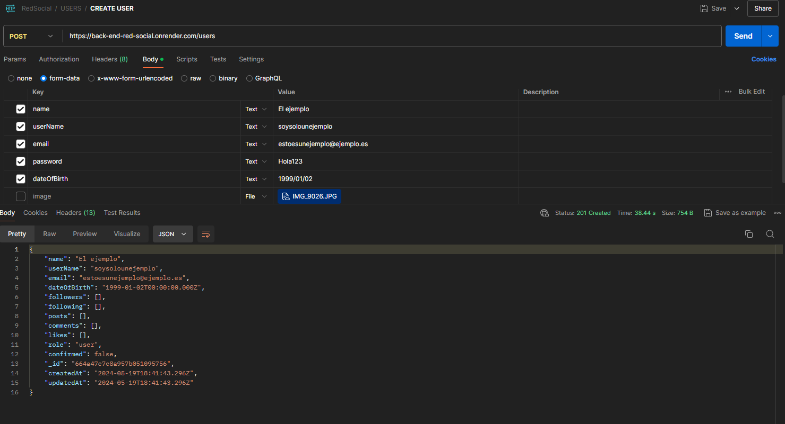
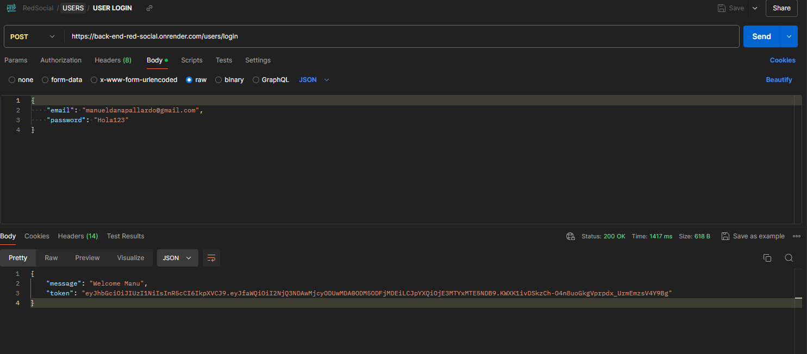
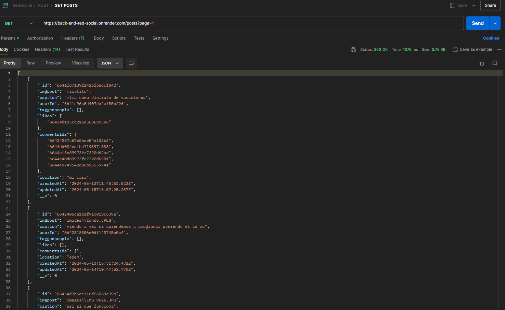
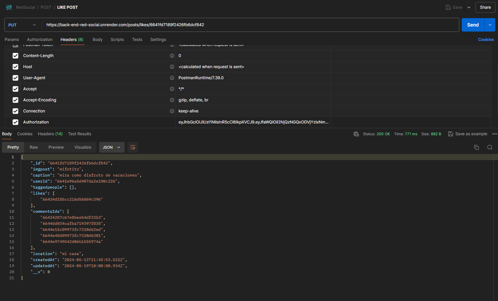
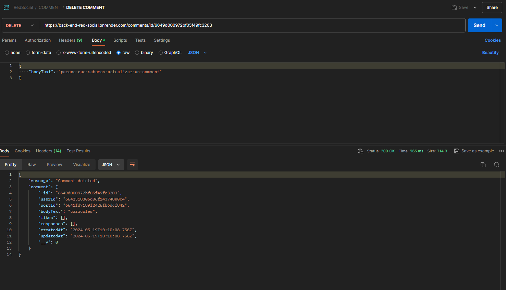

# Proyecto de Backend: API Rest para una Red Social


## Introducción
En este proyecto de backend se combinaron lo conocimientos en las tecnologías Node + Express, además de MongoDB/Mongoose. El proyecto consiste en desarrollar una API REST para una red social.

## Descripción
La API REST será capaz de:
- Crear un CRUD completo para usuarios, posts y comentarios.
- Permitir el login de usuarios con generación de token y uso de middlewares.
- Permitir dar y quitar likes a posteos.
- Está disponible en producción (para ello se utilizo render.com).
- La base de datos fue confeccionada con Mongoose, donde se plantearon las relaciones necesarias para su correcto funcionamiento y automatización.

## Tecnologías
- Node.js
- Express.js
- MongoDB
- Mongoose
- Atlas MongoDB
- Bcrypt
- JWT (Json Web Tokens)
- Multer (para subir imágenes)
- Dotenv (para generar variables de entorno)
- Supertest (para testing)

# Instalación

### Requisitos Previos
- Node.js (versión 14 o superior)
- MongoDB (instancia local o en la nube)
- Git

### Pasos para la Instalación

1. Clonar el repositorio.


2. Instalar las dependencias:
    ```sh
    npm install
    ```

3. Configurar las variables de entorno como en el archivo de "example.env"

4. Iniciar el servidor:
    ```sh
    npm start
    ```


### Uso
Para usar la API, realiza solicitudes HTTP a los endpoints especificados en la sección [Endpoints](#endpoints). Asegúrate de tener configurado un cliente HTTP (como Postman) o usar `curl` para probar los endpoints.

# Endpoints

Documentación de los endpoints: https://documenter.getpostman.com/view/34523070/2sA3QmCuTn

### Usuarios
- **Registrar un usuario**: `POST /users` 
  - RUTA: `/users`
  - MIDDLEWARE: `imgLoad`
  - CONTROLADOR: `UserController.create`



- **Actualizar un usuario**: `PUT /users`
  - RUTA: `/users`
  - MIDDLEWARE: `authentication, imgLoad`
  - CONTROLADOR: `UserController.update`

- **Obtener datos del usuario autenticado**: `GET /users`
  - RUTA: `/users`
  - MIDDLEWARE: `authentication`
  - CONTROLADOR: `UserController.userData`

- **Obtener todos los usuarios**: `GET /users/getAll`
  - RUTA: `/users/getAll`
  - MIDDLEWARE: `authentication`
  - CONTROLADOR: `UserController.getAll`

- **Obtener un usuario por ID**: `GET /users/id/:_id`
  - RUTA: `/users/id/:_id`
  - MIDDLEWARE: `authentication`
  - CONTROLADOR: `UserController.getById`

- **Buscar usuario por nombre**: `GET /users/getByName`
  - RUTA: `/users/getByName`
  - MIDDLEWARE: `authentication`
  - CONTROLADOR: `UserController.getUserByname`

- **Seguir a un usuario**: `PUT /users/follow/:_id`
  - RUTA: `/users/follow/:_id`
  - MIDDLEWARE: `authentication`
  - CONTROLADOR: `UserController.follow`

- **Dejar de seguir a un usuario**: `PUT /users/unfollow/:_id`
  - RUTA: `/users/unfollow/:_id`
  - MIDDLEWARE: `authentication`
  - CONTROLADOR: `UserController.unfollow`

- **Iniciar sesión**: `POST /users/login`
  - RUTA: `/users/login`
  - CONTROLADOR: `UserController.login`



- **Cerrar sesión**: `DELETE /users/logout`
  - RUTA: `/users/logout`
  - MIDDLEWARE: `authentication`
  - CONTROLADOR: `UserController.logout`

- **Recuperar contraseña**: `GET /users/recoverPassword/:email`
  - RUTA: `/users/recoverPassword/:email`
  - CONTROLADOR: `UserController.recoverPassword`

- **Restablecer contraseña**: `PUT /users/resetPassword/:recoverToken`
  - RUTA: `/users/resetPassword/:recoverToken`
  - CONTROLADOR: `UserController.resetPassword`

- **Confirmar correo electrónico**: `PUT /users/confirm/:email`
  - RUTA: `/users/confirm/:email`
  - CONTROLADOR: `UserController.confirm`

### Posts
- **Crear un post**: `POST /posts`
  - RUTA: `/posts`
  - MIDDLEWARE: `authentication, imgLoad`
  - CONTROLADOR: `PostController.create`

- **Obtener todos los posts**: `GET /posts`
  - RUTA: `/posts`
  - CONTROLADOR: `PostController.getAll`
 


- **Actualizar un post**: `PUT /posts/id/:_id`
  - RUTA: `/posts/id/:_id`
  - MIDDLEWARE: `authentication, imgLoad, isAuthor`
  - CONTROLADOR: `PostController.update`

- **Eliminar un post**: `DELETE /posts/id/:_id`
  - RUTA: `/posts/id/:_id`
  - MIDDLEWARE: `authentication, isAuthor`
  - CONTROLADOR: `PostController.delete`

- **Obtener un post por ID**: `GET /posts/id/:_id`
  - RUTA: `/posts/id/:_id`
  - MIDDLEWARE: `authentication`
  - CONTROLADOR: `PostController.getById`

- **Buscar posts por nombre**: `GET /posts/caption`
  - RUTA: `/posts/caption`
  - MIDDLEWARE: `authentication`
  - CONTROLADOR: `PostController.getPostByName`

- **Obtener todos los posts con información detallada**: `GET /posts/allPosts`
  - RUTA: `/posts/allPosts`
  - MIDDLEWARE: `authentication`
  - CONTROLADOR: `PostController.getInfo`

- **Dar like a un post**: `PUT /posts/likes/:_id`
  - RUTA: `/posts/likes/:_id`
  - MIDDLEWARE: `authentication`
  - CONTROLADOR: `PostController.like`
 


- **Quitar like a un post**: `PUT /posts/dislikes/:_id`
  - RUTA: `/posts/dislikes/:_id`
  - MIDDLEWARE: `authentication`
  - CONTROLADOR: `PostController.dislike`

### Comments
- **Crear un comentario**: `POST /comments/id/:_id`
  - RUTA: `/comments/id/:_id`
  - MIDDLEWARE: `authentication`
  - CONTROLADOR: `CommentController.create`

- **Actualizar un comentario**: `PUT /comments/id/:_id`
  - RUTA: `/comments/id/:_id`
  - MIDDLEWARE: `authentication, isYourComment`
  - CONTROLADOR: `CommentController.update`

- **Eliminar un comentario**: `DELETE /comments/id/:_id`
  - RUTA: `/comments/id/:_id`
  - MIDDLEWARE: `authentication, isYourComment`
  - CONTROLADOR: `CommentController.delete`



- **Dar like a un comentario**: `PUT /comments/likes/:_id`
  - RUTA: `/comments/likes/:_id`
  - MIDDLEWARE: `authentication`
  - CONTROLADOR: `CommentController.like`

- **Quitar like a un comentario**: `PUT /comments/dislikes/:_id`
  - RUTA: `/comments/dislikes/:_id`
  - MIDDLEWARE: `authentication`
  - CONTROLADOR: `CommentController.dislike`

- **Responder a un comentario**: `PUT /comments/response/:_id`
  - RUTA: `/comments/response/:_id`
  - MIDDLEWARE: `authentication`
  - CONTROLADOR: `CommentController.addResponse`

- **Dar like a una respuesta**: `PUT /comments/likeresponse/:responseId`
  - RUTA: `/comments/likeresponse/:responseId`
  - MIDDLEWARE: `authentication`
  - CONTROLADOR: `CommentController.likeResponse`

- **Quitar like a una respuesta**: `PUT /comments/dislikeresponse/:responseId`


## Extras
Si configuras adecuadamente el archivo "env." podras desplegar la aplicación en un servidor web. A los fines de este proyecto se utilizo "render.com" y no hubo inconveniente alguno. 

## Contribución
Este proyecto fue diseñado por:
https://github.com/SebasBarrientos y https://github.com/manudana11 
## Contacto
https://www.linkedin.com/in/sebasbarrientos/

https://www.linkedin.com/in/manuel-dana-pallard%C3%B3/
# backend-tuktuk
